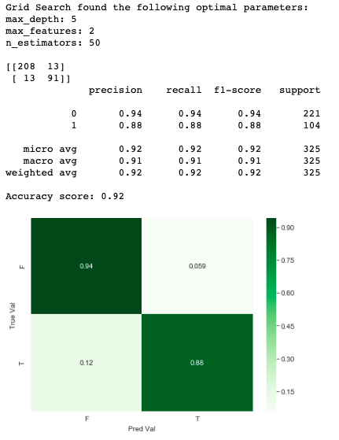
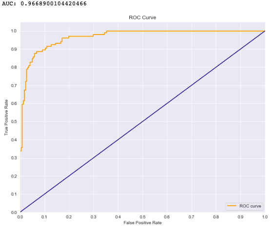
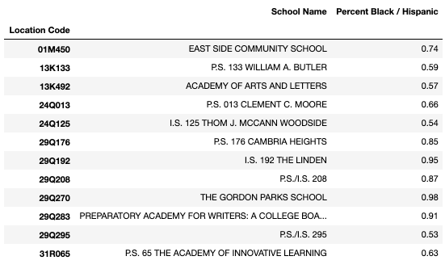
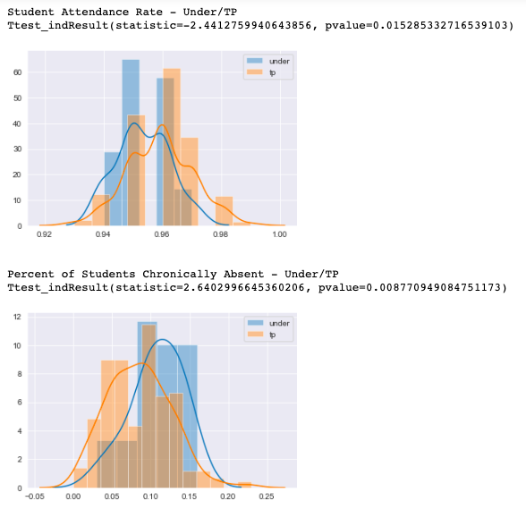

# The Minority Math Problem

In STEM areas of study, there is a significant lack of minority presence. One of the most tangible ways for us to improve the level of diversity is to get minority students more involved at the grade school and high school levels. In New York City, there are a number of magnet type schools focused on math and the sciences that can give students a significant leg up in their STEM careers, and this project aims to show how we can grow the minority presence in these schools.

This project will look to create a predictive model for schools with high math scores, and then look to the schools that are underperforming (where the model predicts that, given the factors present, the school should have high math scores, but in fact does not). We then look at the differences between the underperforming population and the true to performance population, to see where the city can invest its resources to have the greatest impact in schools that are underperforming against expectations and have a majority minority population.

We begin our process by reading in the 2016 School Explorer Dataset and eliminating a variety of columns that are not useful to our analysis as well as importing the Pupil to Teacher dataset for joining to main dataset, and removing outliers (defined as rigorous instruction % values at 0.0%).

We define a high math score as being in the upper quartile of the range of values in the dataset (which turns out to be a score of approximately 2.98 or above).

We then perform a PCA analysis to see what usefulness that may have in the classification of our data. While it was a useful exercise to look at the number of useful factors in this analysis, we would want to ideally use 8 out of the 12 components to acheive a decent portion of explained variance. For this project, it was determined it would be beneficial to keep the original 12 predictors in model analysis, and only cull that number should feature importance dictate.

So we next use the recursive feature elimination tool from SKLearn to determine which of our features are superfluous to the model, and would likely introduce too much noise, causing overfit. As we can see from the Decision Tree, Random Forest, and XGBoost RFE analysis Grade_range, Trust %, and Collaborative Teachers % consistently are the lowest ranked features for importance, and likely introduce more noise than we need. We therefore will remove them from our dataset.

All of these additional models (KNN, Random Forest, SVC, XGBoost) perform fairly similarly, but for our purposes we will utilize the Random Forest method, as it ranks high in its f1 score and is a fairly interpretable model, should we need to modify in the future with more data.

We then set up our model to predict scores based on the best criteria found via grid search, and compare our predicted values against the actual values to determine what are our underperforming schools. We look at the underperforming schools, and then filter those by schools who have a minority population, as given our problem statement, those are the ones where we want to enact the greatest amount of change.

While knowing where to invest in (i.e. where schools are underperforming from what the model predicts) is useful information, knowing what areas to develop at these institutions is even more valuable. Below, we perform and independent sample T-test to determine where the underperforming schools differ from the True Positive (correctly predicted) schools to analyze this question.

Our null hypothesis here is that there is no difference in the sample mean between the underperforming population and the correctly predicted population of schools on any and or all of the predictors used in this analysis. We reject the null hypothesis should the p-value for any difference in population mean be smaller than 0.05, and should that be true, we display the graph for that difference, as well as the corresponding p-value.

And from this, we see that first and foremost, investment in making sure that students are in their class and not absent is the number one priority. Whether this means creating easier ways for children at these schools to get to the school itself, or a more concerted effort in making sure parents have the opportunity and drive to make sure their kids get to school will be determined on a school by school basis, and is beyond the scope of this investigation.

This should at least serve as a baseline for where the city needs to spend its valuable education resources to bring more minority students up in math scores so they can have a chance at attending the prestigous math and science prep schools in the city, so we can help close this gap in minority STEM representation.
